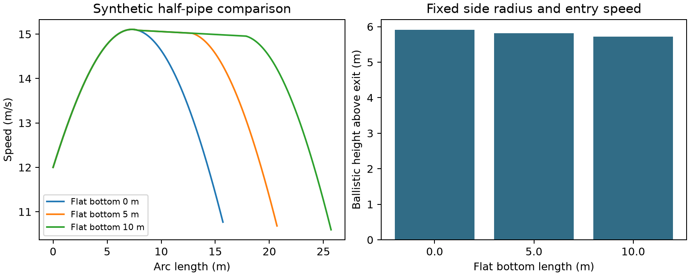

# 半管滑道局部模型：合成参数演示

参考 P26 的能量收支思想，独立求解两段四分之一圆弧与底部直线。半径5 m、入场速度12 m/s、摩擦系数0.02，均为本例设定。令 q=v²，向上为 y 正向：dq/ds=-2g y′-2μ(g x′+κq)。分段积分并在 q=0 停止；出场后按竖直抛射计算 h=q/(2g)。

| 底部长/m | 出场速度/(m/s) | 抛射高度/m |
|---|---|---|
| 0 | 10.7674 | 5.9091 |
| 5 | 10.6815 | 5.8152 |
| 10 | 10.5949 | 5.7213 |

固定半径时，增加底部长度降低本例的出场速度；此比较同时改变滑道宽度与总弧长，不能声称普遍最佳设计。未建模主动蹬伸、空气阻力、沿坡运动或旋转，也未复现原论文整题。无摩擦极限保持初末同高速度，收紧积分容差用于数值核验。结果及版本在 results.json，数据在 halfpipe.csv。
